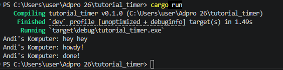
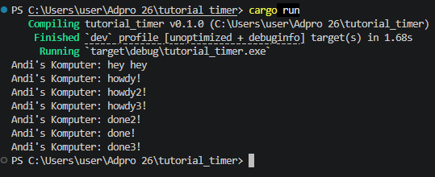
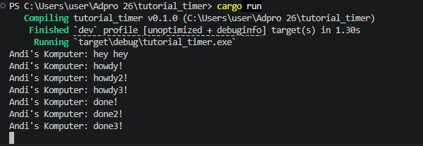
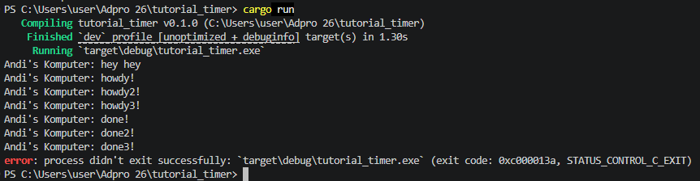

# Modul 10 - Advanced Programming

## Experiment 1.2: Understanding how it works

**Hasil Eksekusi:**

**Penjelasan:**
Mengapa tulisan `hey hey` muncul terlebih dahulu padahal ditulis setelah blok `spawner.spawn`? 

Hal ini terjadi karena fungsi `spawner.spawn` pada dasarnya hanya mengkonstruksi dan mengirimkan *future* (tugas) ke dalam antrean (channel) yang dimiliki oleh `executor`, tetapi **tidak langsung mengeksekusinya**. Eksekusi tugas asinkronus tersebut baru benar-benar berjalan ketika metode `executor.run()` dipanggil di akhir baris fungsi `main`.

Oleh karena itu, alur eksekusi *synchronous* pada *main thread* akan terus berjalan dan mengeksekusi `println!("Andi's Komputer: hey hey");` terlebih dahulu. Setelah itu, barulah `executor.run()` dipanggil, yang kemudian mengambil tugas dari antrean dan mulai mencetak `howdy!`, menunggu 2 detik, lalu mencetak `done!`.

## Experiment 1.3: Multiple Spawn and removing drop

**What is the effect of spawning?**
Efek dari melakukan *multiple spawn* adalah kita mendaftarkan beberapa *future* (tugas) ke dalam antrean *executor* untuk dieksekusi secara konkuren. Hal ini terlihat dari output terminal di mana semua tugas mencetak `howdy` secara langsung tanpa harus menunggu tugas sebelumnya selesai mencetak `done` terlebih dahulu. Saat `TimerFuture` di-*await*, tugas tersebut menyerahkan kembali kendali ke *executor* sehingga tugas lain bisa berjalan selama masa tunggu 2 detik tersebut.

**What is the spawner for, what is the executor for, what is the drop for?**
- **Spawner:** Berperan sebagai pengirim pesan (*sender*). Ia membungkus *future* ke dalam sebuah `Task` dan mengirimkannya ke antrean (channel) milik *executor*.
- **Executor:** Berperan sebagai penerima pesan (*receiver*). Ia mengambil tugas dari antrean dan memanggil `.poll()` pada *future* tersebut untuk mengeksekusinya. Jika tugas belum selesai (*Pending*), tugas tersebut akan ditunda dan *executor* lanjut mengerjakan tugas lain.
- **Drop:** Fungsi `drop(spawner)` digunakan untuk menutup bagian pengirim (*sender*) dari *channel*. Hal ini memberikan sinyal kepada *executor* bahwa tidak akan ada lagi tugas baru yang dikirim.

**What is the correlation of all of that?**
Korelasi ketiganya membentuk pola *producer-consumer*. Spawner bertindak sebagai *producer* yang memproduksi tugas, dan Executor bertindak sebagai *consumer* yang menjalankan tugas. Penghubung keduanya adalah antrean berbasis *channel*. 

Ketika kita menghapus (mengomentari) `drop(spawner);`, *channel pengirim* tidak pernah ditutup. Akibatnya, `executor.run()` yang memiliki *loop* `while let Ok(task) = self.ready_queue.recv()` akan terus menunggu (terblokir) karena ia mengira masih akan ada pesan/tugas baru yang mungkin dikirim oleh spawner di masa depan. Hal inilah yang menyebabkan program menjadi *hang* dan tidak mau berhenti meskipun semua tugas sudah selesai.
